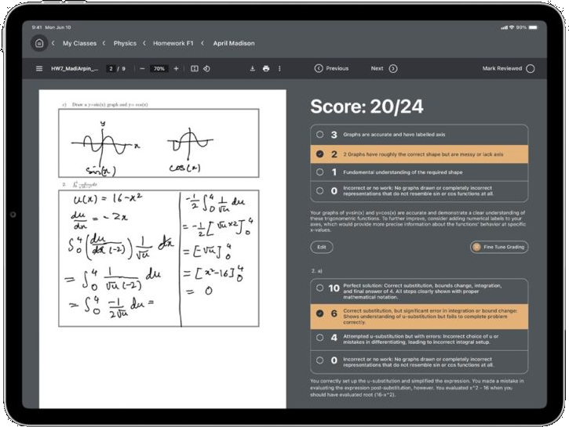
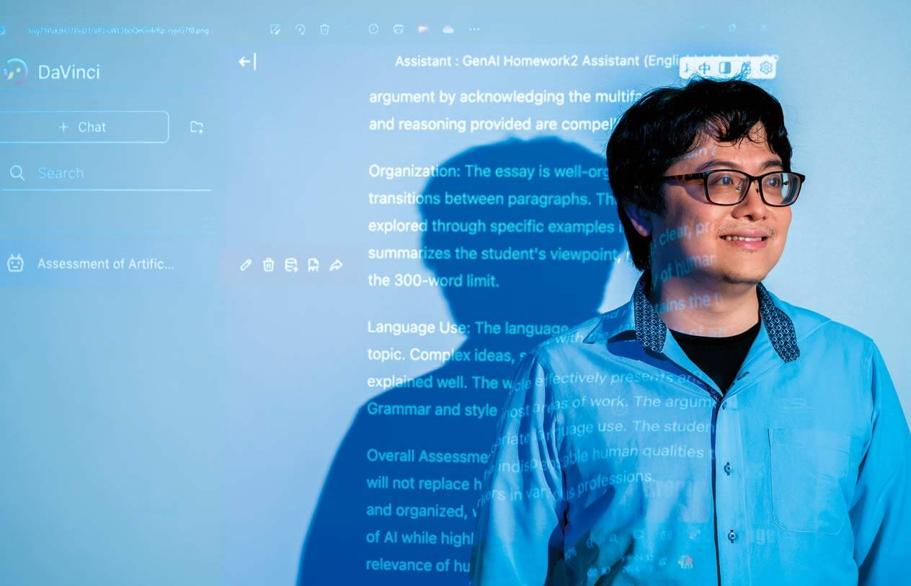

# 前言：教還是被教？

::: layout 章節

----

# AI在教育領域的應用

這邊應該要找一些文獻的例子
https://technews.tw/2025/04/26/gradewiz/

----

https://docs.google.com/presentation/d/11hYhjB6z04UtQRjESZcsbKuA5stkzdS9arwZ1I1naR4/edit#slide=id.SLIDES_API965015192_34

::: note 現在的學生很喜歡問LLM

----

https://docs.google.com/presentation/d/1Jg-twLmwqCZNXBavhz-yvTCF6fr9t_BhDZc6Pe8k6Rg/edit#slide=id.SLIDES_API1386172973_48

::: notes

編目問題

作者名字寫錯

----

https://docs.google.com/presentation/d/1lL-tQSZmsMasftMTSY1kC047vERrNM3ggCUhavF9l4Y/edit#slide=id.SLIDES_API1275230439_32

::: draw comment 哆啦布丁\~~ 到底該怎麼處理才好~~？

::: note 問問AI好了，哆啦A夢

----

https://docs.google.com/presentation/d/1Jg-twLmwqCZNXBavhz-yvTCF6fr9t_BhDZc6Pe8k6Rg/edit#slide=id.SLIDES_API1386172973_118

::: note 來看看回答

----

https://docs.google.com/presentation/d/1Jg-twLmwqCZNXBavhz-yvTCF6fr9t_BhDZc6Pe8k6Rg/edit#slide=id.SLIDES_API1386172973_143

::: note 都是錯的！！

----

https://docs.google.com/presentation/d/11hYhjB6z04UtQRjESZcsbKuA5stkzdS9arwZ1I1naR4/edit#slide=id.g34a706f08a3_0_181

::: comment draw 加上驚訝希希，拿掉難以調整

::: note 大型語言模型的侷限

----

::: smartart {size: 0.8}

- 執行指定任務
- 理解多模態文件能力
- 模仿老師評分
- 擁有專業領域知識

# 打造特定任務的AI助理

----

# AI在教育領域的應用

- **將文本總結成適合程度的語言**：藉由調整語言難度，使其內容讓目標受眾容易理解。
- **糾正語法和拼字錯誤**：更容易識別並修正學生寫作的基本問題。
- **生成作業提示**：根據指定元素(如人物、地點、情節)生成獨特且有創意的寫作作業提示。
- **建立上課教材**：能夠從教材中提取主要概念，生成簡報筆記或大綱。
- **生成課程靈感**：可以協助產生針對特定主題和不同程度的新課程產生靈感。
- **為測驗或閱讀練習調整文本難度及生成問題**：能根據所需的難度和範圍創建適合的閱讀的文本，以及對應的理解性問題。

::: cite Bonner, E., Lege, R., & Frazier, E. (2023). Large Language Model-Based Artificial Intelligence in the Language Classroom: Practical Ideas for Teaching. *Teaching English with Technology*, *23*(1), 23–41.

::: notes

這邊應該要找一些文獻的例子
https://technews.tw/2025/04/26/gradewiz/

整理該文獻中提到使用LLM在教學的例子，輸出格式如下：

- [標題 粗體]：(1~2句話概述)

:::

----

# 紙本作業的掃描與批改：GradeWiz

::: cite https://www.gradewiz.ai/marketing/index.html

----

# 自訂AI助教來回答同學問題

::: cite Modran, H. A., Bogdan, I. C., Ursuțiu, D., Samoilă, C., & Modran, P. L. (2025). LLM Intelligent Agent Tutoring in Higher Education Courses Using a RAG Approach. In M. E. Auer & T. Rüütmann (Eds.), Futureproofing Engineering Education for Global Responsibility (pp. 589–599). Springer Nature Switzerland. https://doi.org/10.1007/978-3-031-83520-9_54

----

# 聯發科：達哥

- 聯發科內部使用的AI，嘗試轉型成向外推廣的產品
  - 2023 ~ 2024年 聯發科教育基金會大力推廣達哥。因此讓很多教育界人士知道達哥。
- 李宏毅開設的課程「生成式人工智慧導論」，在達哥平台上打造了課程AI助教，直接批改學生作業。
  - 教師用提示詞中說明作業批改標準、不同評分等級需要符合哪些條件。
  - 學生上傳作業後會取得作業內容的優缺點說明，以及「最終等第：Ｘ分」

----

# 臺大李宏毅老師利用AI批改學生作業

::: cite 吳凱琳（2024，七月12日）。*AI如何批改作業？*。Hami書城。快讀。[https://app.blog.hamibook.com.tw/%e6%96%b0%e8%81%9e%e6%99%82%e4%ba%8b/ai%e5%a6%82%e4%bd%95%e6%89%b9%e6%94%b9%e4%bd%9c%e6%a5%ad%ef%bc%9f](https://app.blog.hamibook.com.tw/%e6%96%b0%e8%81%9e%e6%99%82%e4%ba%8b/ai%e5%a6%82%e4%bd%95%e6%89%b9%e6%94%b9%e4%bd%9c%e6%a5%ad%ef%bc%9f)