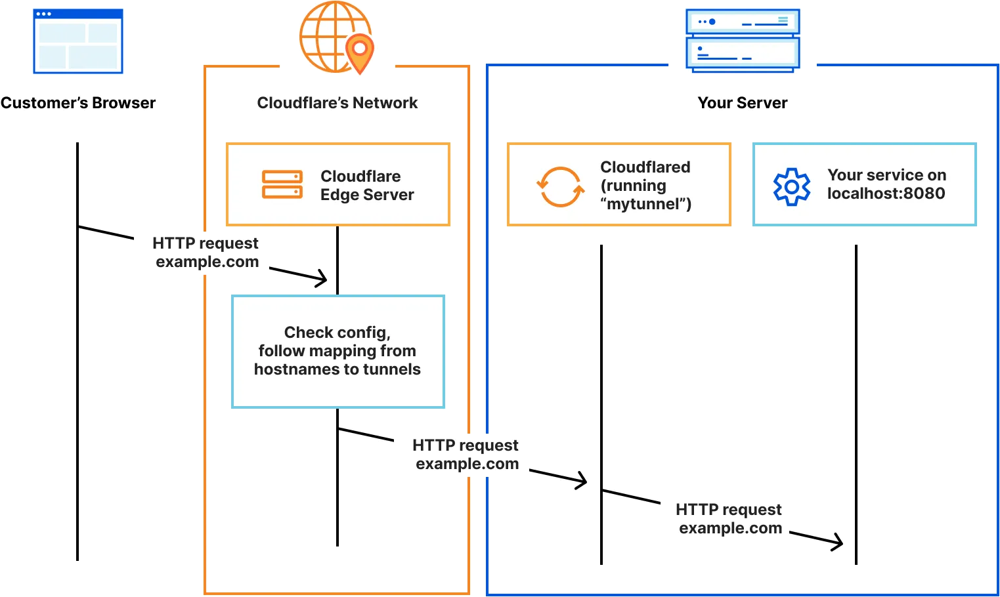

# LLM應用框架

----

https://docs.google.com/presentation/d/163lC9Nz0AiKb947ooC_cwXln5tFb0pBeeqB5tkdbz4s/edit#slide=id.g317ebb40381_0_4

::: notes

什麼是LLM應用框架

應該有投影片，工業的那個
:::

----

https://docs.google.com/presentation/d/163lC9Nz0AiKb947ooC_cwXln5tFb0pBeeqB5tkdbz4s/edit#slide=id.g317ebb40381_0_406

::: notes

LangChain

----

# Dify

https://docs.google.com/presentation/d/163lC9Nz0AiKb947ooC_cwXln5tFb0pBeeqB5tkdbz4s/edit#slide=id.g317f06dff2f_0_85

::: notes

應該有投影片，工業的那個

----

https://docs.google.com/presentation/d/163lC9Nz0AiKb947ooC_cwXln5tFb0pBeeqB5tkdbz4s/edit#slide=id.g317f06dff2f_0_193

::: note Chatbot

----

https://docs.google.com/presentation/d/163lC9Nz0AiKb947ooC_cwXln5tFb0pBeeqB5tkdbz4s/edit#slide=id.g317f06dff2f_0_201

::: note Workflow

----

# 系統架構圖

- Dify編排AI助理
- API LLM
- API Text Embeding
- API Search
- Tunnel 外聯

::: note @TODO

先放上去，然後再手動畫吧

----

# <small>Application Programming Interface</small> / API

- 類型：
  - 大型語言模型API：OpenAI、Claude、Gemini
  - 文字嵌入API (Text Embedding)：Hugging Face
  - 網頁爬蟲 (Webpage to Markdown)：Firecrawl
  - 搜尋功能：SerpApi (Google Search)
- 來源：
  - 使用公開網站的API
  - 自行架設的API：Ollama、LocalAI

----

# <small>Large Language Model</small> 大型語言模型

- LLM是LLM應用框架中用來處理自然語言的核心元件。
- LLM輸入的資料：使用者的提示詞
  - 需要翻譯的文字
  - 需要評分的文本
  - 需要判斷的圖片
- LLM輸出的資料：回答結果
  - 通常是以Markdown語法展示
- LLM的參數設定：
  - 系統角色(System Role)：指定LLM的任務與回答形式
  - 溫度(Temperature)：越接近0越保守、越接近1越創意

----

# LLM提供者

- OpenAI是廣為人知的ChatGPT背後的模型，最新是GPT-4o。
- Claude擅長程式碼的開發，最新的Claude Sonnet是AI開發程式的首選。
- DeepSeek是由中國團隊開發，DeepSeek R2的思維模型啟發眾多關注。
- Gemini是由Google開發的多模態LLM，可免費使用。

----

# Google Gemini

- Gemini是Google開發的先進大型語言模型，是世界頂尖水準LLM排行的常客
- 原生多模態架構：可理解文字、圖像、音訊、影片等多媒體，也可以畫圖
- 資訊搜尋優勢：Gemini背後具備Google搜尋強大後盾，處理最新資訊更為可靠
- Gemini模型提供多種免費使用的管道。
  - 開發者可免費調用Gemini Pro的API接口。
  - 免費API方案通常設有每分鐘請求次數限制。通常是每分鐘10次
- 線上體驗Gemini: https://gemini.google.com/

----

# Cloudflare Tunnel

- ​Cloudflare是美國科技公司，提供內容傳遞網路(CDN)、網路安全和DNS等服務，只在提升網站速度並防禦資訊安全攻擊
- Cloudflare Tunnel 能讓動態產生的網址連接到本機上的服務
  - 只要本機能夠上網即可使用，無需設定防火牆，簡化了以往複雜的網路安全配置
  - 能隱藏本機的真實 IP 位址，降低資安風險，俗稱「內網穿透」
- 免費使用：不需登入的 Cloudflare Tunnel 可以取得網址
- 限制：
  - 每次取得的網址都不相同，也不能頻繁取得網址
  - 只要伺服器網路斷線，或是在一定時間後，網址就會生效，必須重新申請

----

# Cloudflare Tunnel架構

::: cite https://developers.cloudflare.com/cloudflare-one/connections/connect-networks/

----

# 系統架構圖

....配置並安裝起來...嗯...

